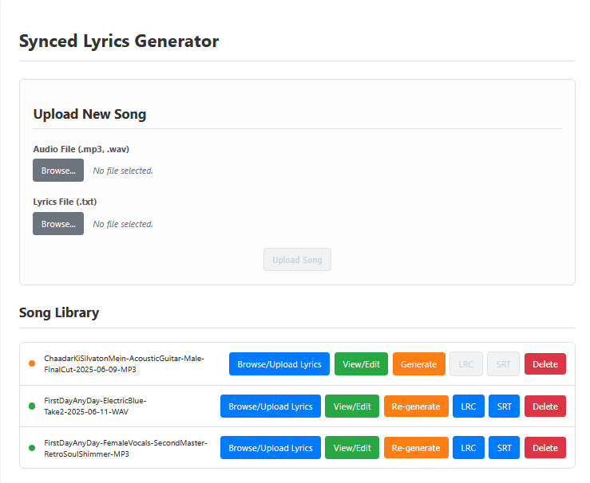

# Synced Lyrics Generator

A web-based tool to create, manage, and edit synchronized lyrics files (LRC and SRT) for audio tracks.



## Features

- Invite-only access with admin provisioning
- Optional MFA (TOTP) per user
- Per-user storage for audio, lyrics, LRC, and SRT files
- Track quota enforcement to prevent disk overuse
- Browser-based editor for synchronized lyrics
- Generate both LRC and SRT format synchronized lyrics files
- View and download the generated files directly from the browser

## Prerequisites

- Python 3.9+
- SQLite (default)

## Installation

1. Clone the repository:
```bash
git clone https://github.com/pexus/synced-lyrics-generator.git
cd synced-lyrics-generator
```

2. Create a virtual environment (optional but recommended):
```bash
python -m venv venv
source venv/bin/activate  # On Windows, use `venv\Scripts\activate`
```

3. Install the requirements:
```bash
pip install -r requirements.txt
```

4. Configure environment variables (local example):
```bash
cp .env.sample .env
# edit .env with your values
```

5. Run the application:
```bash
python app.py
```

6. Open your browser and navigate to:
```
http://127.0.0.1:5000/setup
```
This first-time setup lets you create the initial admin account.

## Quick Local Test (Fresh Start)

If you want a clean slate locally:
```bash
rm -rf data storage
```

Then run the app and visit `/setup` to create the first admin:
```bash
python app.py
```

## Admin & Invites

- Admins can invite users from the `/admin` panel.
- Users receive an email invite, set their password, and can optionally enable MFA.
- Track quota is enforced per user (default: 20). Users must delete older tracks to upload new ones.

## Configuration

- `PUBLIC_BASE_URL`: Used in invite emails. Set to your external host in production.
- `MAX_TRACKS_PER_USER`: Default quota used if no admin setting exists.
- `SECRET_KEY`: Required for session security.
- `DATABASE_URL`: Override the default SQLite path (optional).
- `STORAGE_ROOT`: Base directory for per-user files (optional).
- `SMTP_*`: SMTP server settings for invite emails.
- `MFA_ISSUER`: Optional label shown in authenticator apps.

## Per-user Storage Layout

```
storage/
  user_<id>/
    audio_input/
    lyrics_input/
    lrc_output/
    srt_output/
```

## Docker

Build and run locally:
```bash
docker build -t synced-lyrics .

docker run -p 5000:5000 \
  -v $PWD/data:/app/data \
  -v $PWD/storage:/app/storage \
  synced-lyrics
```

The app auto-loads `/app/data/.env` if it exists. To use the sample values:
```bash
cp .env.sample ./data/.env
```

## GitHub Container Registry (GHCR)

A GitHub Actions workflow is included to build and publish images to GHCR on every push to `main`.

Pull the image:
```bash
docker pull ghcr.io/pexus/synced-lyrics-generator:latest
```

Manual build/push (optional, if you don't want to use GitHub Actions):
```bash
docker login ghcr.io
docker build -t ghcr.io/pexus/synced-lyrics-generator:latest .
docker push ghcr.io/pexus/synced-lyrics-generator:latest
```

## VPS Deployment (Docker + Apache + SSL)

1) Pull and run the container:
```bash
docker pull ghcr.io/pexus/synced-lyrics-generator:latest

docker run -d --name synced-lyrics \
  -p 5000:5000 \
  -v /opt/synced-lyrics/data:/app/data \
  -v /opt/synced-lyrics/storage:/app/storage \
  ghcr.io/pexus/synced-lyrics-generator:latest
```

Store your environment values in `/opt/synced-lyrics/data/.env` so the container picks them up.

2) Apache reverse proxy setup (Ubuntu example):
```bash
sudo apt-get update
sudo apt-get install -y apache2
sudo a2enmod proxy proxy_http headers rewrite ssl
```

Create `/etc/apache2/sites-available/synced-lyrics.conf`:
```apache
<VirtualHost *:80>
    ServerName your-domain.com

    ProxyPreserveHost On
    ProxyPass / http://127.0.0.1:5000/
    ProxyPassReverse / http://127.0.0.1:5000/

    RequestHeader set X-Forwarded-Proto "http"
    RequestHeader set X-Forwarded-For %{REMOTE_ADDR}s
</VirtualHost>
```

Enable the site and reload:
```bash
sudo a2ensite synced-lyrics.conf
sudo apache2ctl configtest
sudo systemctl reload apache2
```

3) Free SSL via Certbot:
```bash
sudo apt-get install -y certbot python3-certbot-apache
sudo certbot --apache -d your-domain.com --redirect
```

Certbot will update the Apache vhost to include SSL and auto-renew certificates. After it runs, ensure the SSL vhost includes:
```apache
RequestHeader set X-Forwarded-Proto "https"
```

## License

This project is licensed under the MIT License - see the LICENSE file for details.

## Development Process

This project was created using ["vibe coding"](https://en.wikipedia.org/wiki/Vibe_coding) with GitHub Copilot, leveraging various AI models available.

## Acknowledgments

- [WaveSurfer.js](https://wavesurfer-js.org/) for the audio waveform visualization
- Flask for the web framework

## Future Roadmap

See [FUTURE.md](FUTURE.md) for planned enhancements.

## Contributing

Contributions are welcome! Please feel free to submit a Pull Request.
